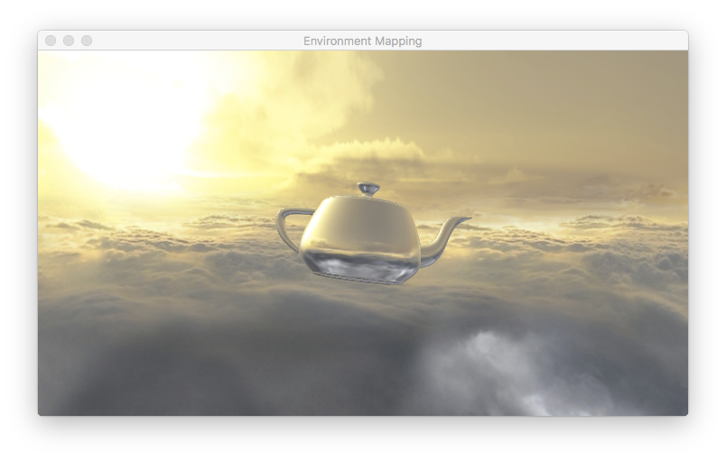

## Exploring GLKMesh 3
<br />
<br />

We delve further into the process of creating **GLKMeshes** objects that can be used in OpenGL demos on the macOS and iOS. There is practically no information on this other than reading Apple's API documentation of the various classes.

As mentioned in the previous demo (ExploringGLKMesh), the **MDLMesh** class method:


```objective-C

    MDLMesh *mdlMesh = [MDLMesh meshWithSCNGeometry:scnGeometry
                                    bufferAllocator:allocator];


```
<br />

can be called to instantiate a **MDLMesh** object using an instance of **GLKMeshBufferAllocator**. However, there are problems creating **GLKMesh** objects from an instance of **MDLAsset**. The **GLKMesh** type method

	newMeshesFromAsset:sourceMeshes:error:
<br />

crashes when an instance of **MDLAsset** is passed as the first parameter.

<br />
<br />

Perusing through Apple's "Documentation and API Reference", we notice that an **SCNNode** object has both a *name* (**NSString**) property and *geometry* (**SCNGeometry**) property. We also note that an **SCNScene** object which represents a scene graph describes a 3D scene and encapsulates a hierarchy of nodes (**SCNNodes**). At the top of the graph is the *rootNode*. All the scene's content is organised as a node hierarchy under this node. Our interest is on the class **SCNNode**. Objects of this class which an instance of **SCNGeometry** as a property. We learnt in the previous demo, such objects can be used to create **MDLMesh** objects which in turn can be used to instantiate a **GLKMesh** object.

```objective-C

    MDLMesh *mdlMesh = [MDLMesh meshWithSCNGeometry:scnGeometry
                                          allocator:allocator:

    GLKMesh *glkMesh = [GLKMesh alloc] initWithMesh:mdlMesh
                                              error:&error];
```
<br />

where error is an instance of **NSError**.

<br />

Apple's SceneKit framework supports the import of scene source files of types .dae, .abc and .scn. And it can also create an **SCNScene** object from an **MDLAsset** object using the **SCNScene** class method *sceneWithMDLAsset:*. In other words, we could create an instance of **MDLAsset**.

```objective-C

    MDLAsset *asset = [[MDLAsset alloc] initWithURL:url
                                   vertexDescriptor:nil     
                                    bufferAllocator:nil];

```

<br />

then create an **SCNScene** object

<br />

```objective-C

    SCNScene *scene = [SCNScene sceneWithMDLAsset:asset];

```
<br />

We can use the *rootNode* property to extract the childNode(s) which are **SCNNodes**. In the case of a simple .OBJ file, SceneKit will build a tree with only 1 child node. So, the process of extracting this single child node is straightforward.

Calling the following method with the **SCNNode** object's geometry (**SCNGeometry**) property will create an **MDLMesh** instance which can be passed as a parameter to the method:

<br />

```objective-C

    MDLMesh *mdlMesh = [MDLMesh meshWithSCNGeometry:scnGeometry
                                    bufferAllocator:allocator];

```

<br />

It is necessary to investigate the properties of the newly-created **GLKMesh** object and those of its associated class objects further before using it in another demo. Briefly, instead of a single vertex buffer, the system has allocated 3 vertex buffers. There is still a single index buffer. The system, as usual, allocates OpenGL Vertex Buffer and Index Buffer objects (VBOs and EBOs) which are accessed as *glBufferName* properties. And the Model class has to be updated to handle multiple VBOs and EBOs.

Now, that opens up a path to using custom **SCNGeometry** (e.g. a Mobius strip, an Octahedron) to create **GLKMesh** objects. 

<br />
<br />

## A brief detail of the demo.

(a) Two models, a skybox and a torus object are instantiated.
<br />
(b) Two pairs of vertex-fragment shaders are compiled.
<br />
(c) A skybox texture is instantiated from an image with a resolution of 6:1.
<br />
(d) A **CVDisplayLink** Object is created to drive a per-frame update of the rendering process.
<br />
<br />


## The Rendering Process

The demo proceeds with setting up the conditions to render the torus object first. The position of a camera is required and is passed as a uniform to the reflection fragment shader. Since the model matrix is not a rotation matrix, its associated normal matrix must be computed. We decided to create a normal matrix on the client side because performing the inverse transpose of the model matrix is expensive if done in the GPU. All the required uniforms are then passed to the torus program before the model is rendered.

Rendering the skybox is straighforward because Modern GPU hardware supports cubemapping out-of-the-box. The vertex shader of the skybox shader program passes the position attribute of a vertex of the skybox as a 3D texture coordinate to its fragment shader. This 3D texture coordinate serves a direction vector from the centre of the skybox to one of its vertices. We normalise the vector in the fragment shader and use it to access the cubemap texture although it is not necessary.

<br />
<br />



Compiled and run under XCode 8.3.2
<br />
<br />

Tested on macOS 10.12
<br />
<br />

Deployment set at macOS 10.11.

<br />
<br />
<br />

Resources:

www.learnopengl.com

